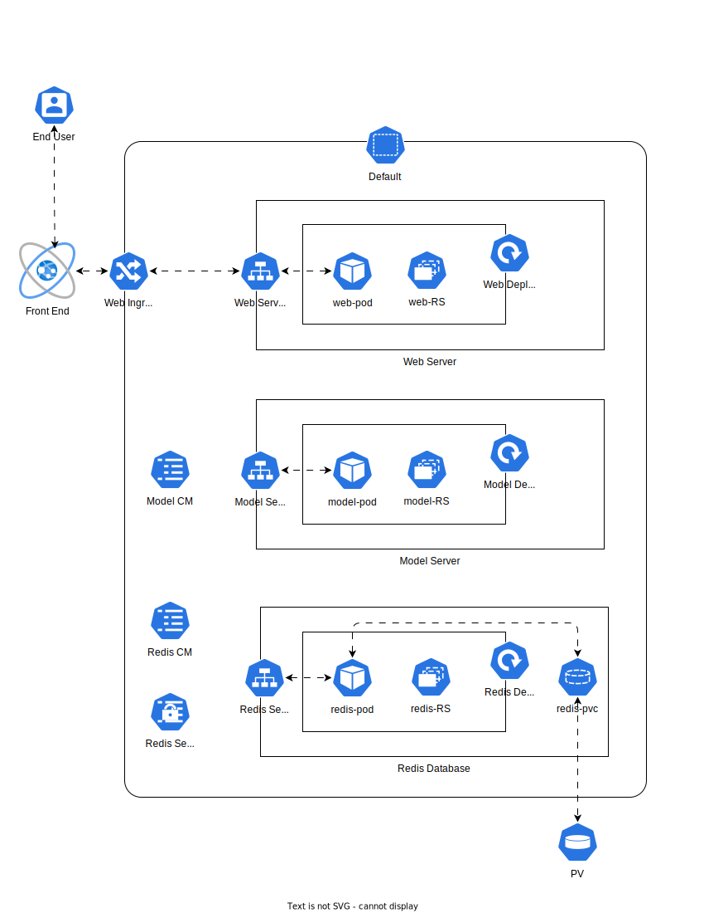
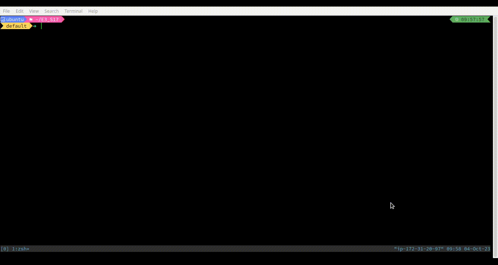
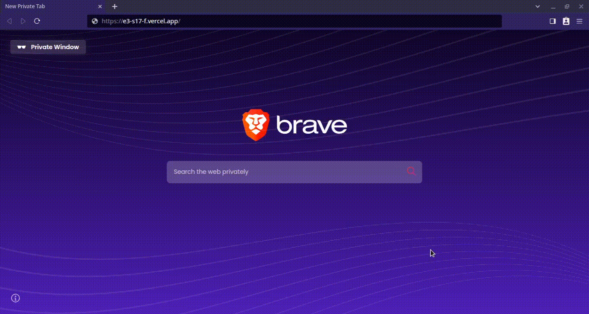

<div align="center">

# Kubernetes, Ingress, Helm, Next.js

</div>

# Overview
In this session, we deploy a GPT2 model to generate text. The architecture is based on a micro-service pattern where the web server and model server are decoupled (and can be scaled independently). The results are cached in a Redis database, which is running in a separate deployment. Recurrent prompts generate text faster since the result has been cached. As a visual proof, the text `[cached]` is prepended before the cached results. The service is exposed via an Ingress. Finally, a frontend is built is Next.js and deployed on Vercel.



# Local - non-docker

The code for the model and web servers are located in their respective sub-directories. For Redis, we use it's Docker image directly.

```bash
# run the redis database
docker run --name redis -p 6379:6379 -e REDIS_PASSWORD=hunter2 -e REDIS_PORT=6379 --restart always redis:7.2.1

# run the model server
uvicorn model_server:app --host 0.0.0.0 --port 8080 --reload

# run the web server
uvicorn web_server:app --host 0.0.0.0 --port 9080 --reload
```

The model server can be browsed at http://localhost:8080 and the web server can be browsed at http://localhost:9080. Note that the web server supports reading from cache whereas the model server doesn't (and always run inference).

# Local - docker
We can build docker images for the servers.
```bash
docker build -t model-server .
docker build -t web-server .
docker compose up
```

# K8 - manifests

## Setup minikube
```bash
curl -LO https://storage.googleapis.com/minikube/releases/latest/minikube-linux-amd64
sudo install minikube-linux-amd64 /usr/local/bin/minikube

minikube start --driver=docker --memory=20200mb --cpus=6

minikube addons enable ingress
minikube addons enable dashboard
minikube addons enable metrics-server
```

## Load Images

```bash
minikube image load model-server:latest
minikube image load web-server:latest
```

## Deploy Manifests
```bash
cd manifests
k apply -f .
```


## Setup ngrok
After creating an API key and auth token on ngrok's website, we can create a domain in ngrok so that we always expose to the same ngrok endpoint everytime instead of a random URL.

```bash
wget https://bin.equinox.io/c/bNyj1mQVY4c/ngrok-v3-stable-linux-amd64.tgz
sudo tar xvzf ngrok-v3-stable-linux-amd64.tgz -C /usr/local/bin
ngrok config add-authtoken .......
ngrok http 192.168.49.2:80 --domain=secure-evident-hyena.ngrok-free.app 80
```

We can run an `ngrok` tunnel:
```bash
ngrok http 192.168.49.2:80 --domain=secure-evident-hyena.ngrok-free.app 80
```


We can now browse to https://secure-evident-hyena.ngrok-free.app and access all the paths as well as the FastAPI docs (Swagger UI).


# K8s - Helm

## Setup Helm

```bash
curl -fsSL -o get_helm.sh https://raw.githubusercontent.com/helm/helm/main/scripts/get-helm-3
chmod 700 get_helm.sh
./get_helm.sh
```

## Create and Deploy Helm

```bash
helm create emlo_s17
cd emlo_s17
rm -rf templates/*
cp ../manifests/* templates/
cat /dev/null > values.yaml

# make changes to values.yaml and templates.
helm install emlo-s17-1 emlo_s17
```


# Frontend
For the frontend, we use Next.js and ShadCN 

```bash
curl -o- https://raw.githubusercontent.com/nvm-sh/nvm/v0.39.5/install.sh | bash
nvm install 16
nvm use 16
npx create-next-app@latest E3_S17F --typescript --tailwind --eslint
npx shadcn-ui@latest init
npx shadcn-ui@latest add button input textarea
```

Finally, we deploy it to Vercel.



# Logs


[kubectl describe deployment.apps/model-server](./output/q1_model.md)

[kubectl describe deployment.apps/web-server](./output/q1_web.md)

[kubectl describe pod/model-server-7f9b678b7-zfv62](./output/q2_model.md)

[kubectl describe pod/web-server-bc7c498f8-rz4x6](./output/q2_web.md)

[kubectl describe ingress/web-server-ingress](./output/q3_ing.md)

[kubectl top pod](./output/q4_pod.md)

[kubectl top node](./output/q5_node.md)


[kubectl get all -A  -o yaml](./output/q6.md)
